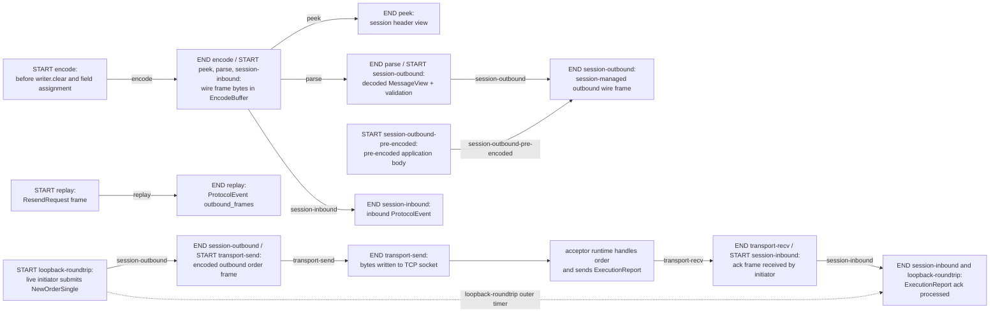
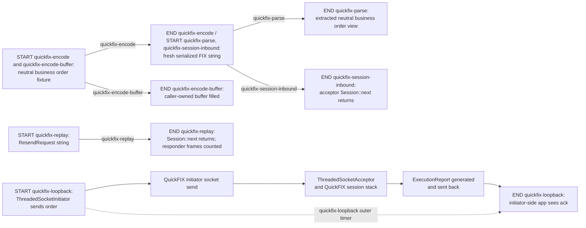
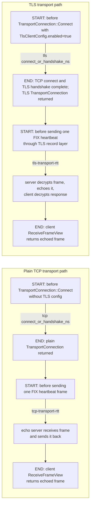

# NimbleFIX Benchmarking

This directory is the canonical benchmark subsystem for NimbleFIX. It contains the two drivers, the neutral FIX44 business-order fixture shared across both engines, and the helper script used to reproduce the published NimbleFIX vs QuickFIX numbers.

## Files

- `main.cpp`: NimbleFIX benchmark driver.
- `quickfix_main.cpp`: QuickFIX C++ comparison driver.
- `bench_support.h`: shared fixture, allocation tracking, timing, perf-counter plumbing, percentile summaries.
- `bench.sh`: build/run entrypoint for all common benchmark workflows.

## Build And Run

`bench.sh` is the intended entrypoint. It auto-selects `xmake >= 3.0.0`, then `cmake + Ninja`, then `cmake + make`:

```bash
./bench/bench.sh build
./bench/bench.sh nimblefix
./bench/bench.sh nimblefix-nfd
./bench/bench.sh quickfix
./bench/bench.sh builder
./bench/bench.sh compare

# Alternative CMake path
NIMBLEFIX_BUILD_SYSTEM=cmake NIMBLEFIX_CMAKE_PRESET=dev-release ./bench/bench.sh build
NIMBLEFIX_BUILD_SYSTEM=cmake NIMBLEFIX_CMAKE_PRESET=dev-release ./bench/bench.sh compare

# Force the make fallback
NIMBLEFIX_BUILD_SYSTEM=cmake NIMBLEFIX_CMAKE_GENERATOR=make NIMBLEFIX_CMAKE_PRESET=dev-release ./bench/bench.sh build

# Direct xmake path that matches the helper's ccache policy
xmake f -m release --ccache=n -y
xmake build nimblefix-bench
xmake build nimblefix-quickfix-cpp-bench
```

Important environment notes:

- `bench.sh` defaults `NIMBLEFIX_XMAKE_CCACHE=n`. This is intentional: Linux xmake builds of the large QuickFIX targets can hit reproducible `.build_cache/... -> .objs/... file busy` failures when compiler cache is enabled.
- Ubuntu 24.04's packaged xmake is currently `2.8.7`, which is too old for this project. In auto mode the helper will print that fact and fall back to CMake.
- All benchmark commands intentionally consume QuickFIX FIX44 inputs only: `bench/vendor/quickfix/spec/FIX44.xml`, `build/bench/quickfix_FIX44.nfd`, or `build/bench/quickfix_FIX44.nfa`.

## Default Suites

| Command | Default args | What it is for |
|---------|--------------|----------------|
| `build` | none | Build all benchmark binaries and regenerate the FIX44 benchmark artifacts |
| `nimblefix` | `--iterations 100000 --loopback 1000 --replay 1000` | Main NimbleFIX suite against `quickfix_FIX44.nfa` |
| `nimblefix-nfd` | `--iterations 30000 --loopback 200 --replay 200` | Same NimbleFIX suite but load the `.nfd` text dictionary directly |
| `quickfix` | `--iterations 100000 --replay 1000 --replay-span 128 --loopback 1000` | Main QuickFIX comparison suite |
| `builder` | `--iterations 100000 --loopback 0 --replay 0` | Encode-focused NimbleFIX iteration loop without replay/loopback noise |
| `compare` | NimbleFIX defaults, then QuickFIX defaults | Full side-by-side report used by the README numbers |

## Where Each Metric Starts And Ends

Each diagram below shows a complete benchmark flow. `START` and `END` mark timing boundaries, and the arrow label is the printed benchmark metric for that segment. A separate diagram is used only when the underlying runtime flow is different.

### NimbleFIX Flow



### QuickFIX Flow



## Exact Measurement Boundaries

Encode comparisons start from the same neutral business object. Both engines pin `SendingTime` to a fixture timestamp so the encode tiers measure object construction and serialization rather than per-iteration clock formatting.

### NimbleFIX Metrics

| Metric | Timing starts at | Timing ends at | What is included |
|--------|------------------|----------------|------------------|
| `encode` | immediately before `writer.clear()` and field assignment on the generated `NewOrderSingleWriter` | after `writer.encode_to_buffer(...)` completes | field population, repeating-group population, frame serialization, BodyLength backfill, checksum append |
| `peek` | immediately before `PeekSessionHeaderView(sample_frame)` | when the header view is returned | raw-frame header extraction only |
| `parse` | immediately before `DecodeFixMessageView(sample_frame)` | when decoded `MessageView` + validation are available | full wire decode, validation, group handling |
| `session-outbound` | immediately before `initiator.SendApplication(sample, ts, envelope)` | when `AdminProtocol` returns the encoded outbound frame | outbound seq allocation, full business-field serialization, session header/trailer assembly, store write |
| `session-outbound-pre-encoded` | immediately before `initiator.SendEncodedApplication(encoded_body, ts, envelope)` | when `AdminProtocol` returns the encoded outbound frame | outbound seq allocation, session-managed header/trailer finalization, store write; excludes business-field serialization because the application body is pre-encoded |
| `session-inbound` | immediately before `acceptor.OnInbound(std::move(frame), NowNs())` | when `ProtocolEvent` returns | full inbound decode, sequence validation, admin/session handling, store write, app-message extraction |
| `replay` | immediately before `acceptor.OnInbound(std::move(resend_request), NowNs())` | when `ProtocolEvent.outbound_frames` returns | ResendRequest handling, store-backed replay generation for `replay_span` messages |
| `loopback-roundtrip` | immediately before the live initiator submits the `NewOrderSingle` | when the initiator receives the `ExecutionReport` ack | full TCP round-trip, both runtimes, both protocol stacks |

The outbound pair intentionally uses the same session setup, the same optional `50/57` envelope values, and the same persistence path. The only intended delta is whether the business body is serialized inside the timed region (`session-outbound`) or supplied as a pre-encoded application payload (`session-outbound-pre-encoded`).

### QuickFIX Metrics

| Metric | Timing starts at | Timing ends at | What is included |
|--------|------------------|----------------|------------------|
| `quickfix-encode` | immediately before `BuildOrderFromBusinessObject(...)` | after `order.toString()` returns a fresh string | QuickFIX object construction plus serialization into a fresh string |
| `quickfix-encode-buffer` | immediately before `BuildOrderFromBusinessObject(...)` | after `order.toString(buffer)` fills the caller-owned buffer | same serializer as above, but with a reused output buffer |
| `quickfix-parse` | immediately before `parsed.setString(sample_frame, ...)` | after `ExtractOrderFromQFMessage(parsed)` returns | frame parse plus extraction back into the neutral business-order view |
| `quickfix-session-inbound` | immediately before `acceptor_session.next(frame, now)` | when `Session::next()` returns | in-process session processing, sequence validation, store interaction; incidental outbound admin is drained outside timing |
| `quickfix-replay` | immediately before `acceptor_session.next(resend_frame, now)` | when `Session::next()` returns | in-process replay generation; emitted replay frames are counted through `BufferedResponder` |
| `quickfix-loopback` | immediately before the threaded initiator sends the order | when the initiator-side loopback app sees the ack | real TCP round-trip via `ThreadedSocketAcceptor` / `ThreadedSocketInitiator` |

## NimbleFIX Loopback Breakdown

The NimbleFIX loopback benchmark prints an additional per-phase breakdown inside the end-to-end RTT window:

- `session-outbound`: application message submission through outbound session encode.
- `transport-send`: bytes written to the socket.
- `transport-recv`: ack bytes received back from the socket.
- `session-inbound`: ack decode plus inbound session handling on the initiator side.

Those four sub-measurements are nested inside the single `loopback-roundtrip` percentile table.

## TLS Transport Baseline

`nimblefix-tls-transport-bench` is a focused transport-level benchmark for the optional TLS layer. It always prints a plain `TransportConnection` TCP RTT baseline. When the binary is built with `NIMBLEFIX_ENABLE_TLS=ON` and certificate material is provided, it also prints TLS connect/handshake latency, steady-state RTT, negotiated protocol/cipher, and whether OpenSSL reported session reuse.



Build and run:

```bash
cmake -S . -B build/cmake/tls-bench -DCMAKE_BUILD_TYPE=Release -DNIMBLEFIX_ENABLE_TLS=ON
cmake --build build/cmake/tls-bench --target nimblefix-tls-transport-bench

./build/cmake/tls-bench/nimblefix-tls-transport-bench \
	--iterations 10000 \
	--warmup 1000 \
	--cert /path/to/server-chain.pem \
	--key /path/to/server-key.pem \
	--ca /path/to/ca.pem
```

The benchmark uses the same frame boundary detection and send/gather-send surface that the live runtime uses. If you omit `--cert`, `--key`, or `--ca`, the run intentionally records only the TCP baseline. If the binary was built without TLS support, the TLS leg is skipped explicitly rather than falling back to plaintext.

## Current Side-By-Side Snapshot (2026-04-14)

Command used:

```bash
./bench/bench.sh compare
```

Environment:

| | |
|---|---|
| CPU | AMD Ryzen 7 7840HS with Radeon 780M Graphics |
| OS | Linux 6.19.10-1-cachyos x86_64 |
| Compiler | `g++ (GCC) 15.2.1 20260209` |
| Build helper | `xmake v3.0.8+20260324` |

### Cross-Engine Summary

| Boundary | NimbleFIX metric | QuickFIX metric | NimbleFIX p50 | NimbleFIX p95 | QuickFIX p50 | QuickFIX p95 | NimbleFIX alloc/op | QuickFIX alloc/op |
|----------|----------------|-----------------|-------------|-------------|--------------|--------------|------------------|-------------------|
| object → wire (reused buffer) | `encode` | `quickfix-encode-buffer` | 371 ns | 401 ns | 1.24 us | 1.43 us | 0 | 29 |
| wire → object | `parse` | `quickfix-parse` | 511 ns | 521 ns | 1.29 us | 1.33 us | 0 | 20 |
| session inbound | `session-inbound` | `quickfix-session-inbound` | 1.65 us | 1.94 us | 2.38 us | 2.75 us | 0 | 18 |
| replay (`replay_span=128`) | `replay` | `quickfix-replay` | 15.66 us | 16.81 us | 231.20 us | 269.07 us | 0 | 4117 |
| TCP loopback RTT | `loopback-roundtrip` | `quickfix-loopback` | 17.58 us | 20.75 us | 20.55 us | 24.68 us | 3 | 77 |

### NimbleFIX Snapshot

| Metric | p50 | p95 | p99 | alloc/op | ops/sec | cache/op | branch/op |
|--------|-----|-----|-----|----------|---------|----------|-----------|
| `encode` | 371 ns | 401 ns | 531 ns | 0 | 2.52M | 0.0 | 0.0 |
| `parse` | 511 ns | 521 ns | 531 ns | 0 | 1.88M | 0.0 | 0.0 |
| `session-inbound` | 1.65 us | 1.94 us | 3.18 us | 0 | 550.9K | 0.4 | 2.1 |
| `replay` | 15.66 us | 16.81 us | 19.23 us | 0 | 63.0K | 1.5 | 5.3 |
| `loopback-roundtrip` | 17.58 us | 20.75 us | 25.12 us | 3 | 54.5K | 11.0 | 194.0 |
| `peek` | 130 ns | 141 ns | 141 ns | 0 | 6.58M | 0.0 | 0.0 |

### QuickFIX Snapshot

| Metric | p50 | p95 | p99 | alloc/op | ops/sec | cache/op | branch/op |
|--------|-----|-----|-----|----------|---------|----------|-----------|
| `quickfix-encode` | 1.34 us | 1.53 us | 1.56 us | 30 | 659.9K | 0.0 | 0.0 |
| `quickfix-parse` | 1.29 us | 1.33 us | 1.34 us | 20 | 723.8K | 0.0 | 0.0 |
| `quickfix-session-inbound` | 2.38 us | 2.75 us | 2.85 us | 18 | 405.3K | 0.3 | 0.2 |
| `quickfix-replay` | 231.20 us | 269.07 us | 272.14 us | 4117 | 4.1K | 17.2 | 242.3 |
| `quickfix-loopback` | 20.55 us | 24.68 us | 31.02 us | 77 | 46.3K | 30.2 | 19.2 |
| `quickfix-encode-buffer` | 1.24 us | 1.43 us | 1.61 us | 29 | 724.0K | 0.0 | 0.0 |

## Metric Fields

Each result is printed as both an aligned table and a verbose raw line.

### Table columns

| Column | Description |
|--------|-------------|
| `Metric` | Benchmark name |
| `Count` | Number of iterations |
| `p50`, `p95`, `p99` | Latency percentiles formatted as `ns` or `us` |
| `Alloc/op` | Heap allocations per iteration from the global allocation hooks |
| `Ops/sec` | Throughput derived from total wall time |
| `Cache/op` | Cache misses per iteration from Linux `perf_event_open`; `n/a` when unavailable |
| `Branch/op` | Branch mispredictions per iteration from Linux `perf_event_open`; `n/a` when unavailable |

### Verbose line fields

The raw line additionally includes:

- `total_ns`, `cpu_ns`, `cpu_pct`
- `allocs`, `alloc_bytes`, `avg_ns`
- `min_ns`, `p50_ns`, `p95_ns`, `p99_ns`, `p999_ns`, `max_ns`
- `ops_per_sec`
- `cache_miss`, `branch_miss`
- `<work_label>` and `<work_label>_per_sec` for benchmarks that emit multiple units per iteration, such as replay frames

## Output Artifacts

- `build/bench/quickfix_FIX44.nfd`: NimbleFIX text dictionary generated from QuickFIX `FIX44.xml`.
- `build/bench/quickfix_FIX44.nfa`: compiled NimbleFIX artifact used by the main FIX44 suite.
- `build/sample-basic.nfa`: shared sample artifact used by tests/codegen, not by the benchmark commands.
- `build/linux/x86_64/release/quickfix-cpp-bench`: xmake output for the QuickFIX comparison binary.
- `build/cmake/<preset>/bin/quickfix-cpp-bench`: Ninja-based CMake output for the QuickFIX comparison binary.
- `build/cmake/<preset>-make/bin/quickfix-cpp-bench`: make-based CMake fallback output for the QuickFIX comparison binary.

If you need the broader development workflow or environment-specific build notes, see `docs/development.md`. This file is intentionally focused on benchmark boundaries and benchmark output.