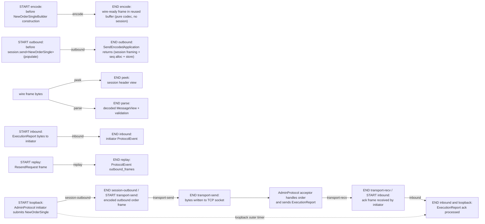
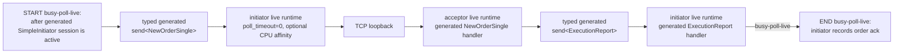
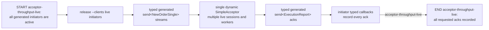
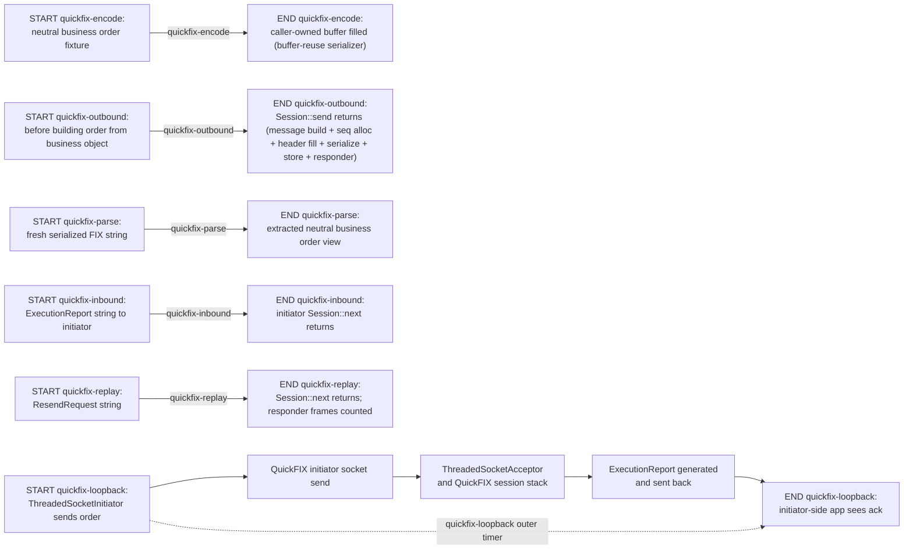
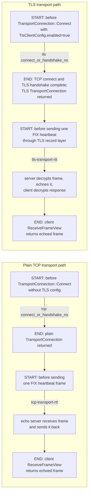

# NimbleFIX Benchmarking

This directory is the canonical benchmark subsystem for NimbleFIX. It contains the two drivers, the neutral FIX44 business-order fixture shared across both engines, and the helper script used to reproduce the published NimbleFIX vs QuickFIX numbers.

## Files

- `main.cpp`: NimbleFIX benchmark driver.
- `quickfix_main.cpp`: QuickFIX C++ comparison driver.
- `bench_support.h`: shared fixture, allocation tracking, timing, perf-counter plumbing, percentile summaries.
- `bench.sh`: build/run entrypoint for all common benchmark workflows.

## Build And Run

`bench.sh` is the intended entrypoint. It auto-selects `xmake >= 3.0.0`, then `cmake + Ninja`, then `cmake + make`:

```bash
./bench/bench.sh build
./bench/bench.sh nimblefix
./bench/bench.sh nimblefix-nfd
./bench/bench.sh quickfix
./bench/bench.sh compare
./bench/bench.sh parse-only
./bench/bench.sh internal-send
./bench/bench.sh overall-send
./bench/bench.sh rtt-half
./bench/bench.sh multi-client
./bench/bench.sh busy-poll
./bench/bench.sh acceptor-throughput

# Alternative CMake path
NIMBLEFIX_BUILD_SYSTEM=cmake NIMBLEFIX_CMAKE_PRESET=dev-release ./bench/bench.sh build
NIMBLEFIX_BUILD_SYSTEM=cmake NIMBLEFIX_CMAKE_PRESET=dev-release ./bench/bench.sh compare

# Force the make fallback
NIMBLEFIX_BUILD_SYSTEM=cmake NIMBLEFIX_CMAKE_GENERATOR=make NIMBLEFIX_CMAKE_PRESET=dev-release ./bench/bench.sh build

# Direct xmake path that matches the helper's ccache policy
xmake f -m release --ccache=n -y
xmake build nimblefix-bench
xmake build nimblefix-quickfix-cpp-bench
```

Inbound phase profiling is compile-time off by default because it inserts clock probes into the session hot path. Enable it only for diagnosis with `xmake f -m release --ccache=n --nimblefix_enable_bench_profile=true -y` or CMake `-DNIMBLEFIX_ENABLE_BENCH_PROFILE=ON`; when enabled, `nimblefix-bench` prints the extra inbound breakdown.

Important environment notes:

- `bench.sh` defaults `NIMBLEFIX_XMAKE_CCACHE=n`. This is intentional: Linux xmake builds of the large QuickFIX targets can hit reproducible `.build_cache/... -> .objs/... file busy` failures when compiler cache is enabled.
- Ubuntu 24.04's packaged xmake is currently `2.8.7`, which is too old for this project. In auto mode the helper will print that fact and fall back to CMake.
- All benchmark commands intentionally consume QuickFIX FIX44 inputs only: `bench/vendor/quickfix/spec/FIX44.xml`, `build/bench/quickfix_FIX44.nfd`, or `build/bench/quickfix_FIX44.nfa`.

## Default Suites

| Command | Default args | What it is for |
|---------|--------------|----------------|
| `build` | none | Build the default compare benchmark binaries and regenerate the FIX44 benchmark artifacts |
| `nimblefix` | `--iterations 100000 --loopback 1000 --replay 1000` | Main NimbleFIX suite against `quickfix_FIX44.nfa` |
| `nimblefix-nfd` | `--iterations 30000 --loopback 200 --replay 200` | Same NimbleFIX suite but load the `.nfd` text dictionary directly |
| `quickfix` | `--iterations 100000 --replay 1000 --replay-span 128 --loopback 1000` | Main QuickFIX comparison suite |
| `compare` | NimbleFIX defaults, then QuickFIX defaults | Full side-by-side report used by the README numbers |
| `parse-only` | `--iterations 100000` | NimbleFIX raw wire parse/decode only |
| `internal-send` | `--iterations 100000` | NimbleFIX generated body plus full-frame encode without session state |
| `overall-send` | `--iterations 100000` | NimbleFIX typed session send without TCP |
| `rtt-half` | `--iterations 100000 --loopback 1000` | NimbleFIX AdminProtocol/direct-TCP loopback reported as half RTT |
| `multi-client` | `--iterations 4000 --clients 4` | Concurrent independent NimbleFIX AdminProtocol/direct-TCP loopback pairs |
| `busy-poll` | `--iterations 100000` | Full NimbleFIX live-runtime initiator/acceptor RTT with no-sleep polling and optional CPU affinity |
| `acceptor-throughput` | `--iterations 100000 --clients 4` | One dynamic live acceptor with multiple generated live initiator sessions |

## Where Each Metric Starts And Ends

Each diagram below shows a complete benchmark flow. `START` and `END` mark timing boundaries, and the arrow label is the printed benchmark metric for that segment. A separate diagram is used only when the underlying runtime flow is different.

### NimbleFIX Flow


```mermaid
flowchart LR
	SC["START encode:<br/>before NewOrderSingleBuilder construction"] -->|encode| SE["END encode:<br/>wire-ready frame in reused buffer (pure codec, no session)"]
	OM["START outbound:<br/>before session.send&lt;NewOrderSingle&gt;(populate)"] -->|outbound| OE["END outbound:<br/>SendEncodedApplication returns (session framing + seq alloc + store)"]
	WF["wire frame bytes"] -->|peek| PH["END peek:<br/>session header view"]
	WF -->|parse| MV["END parse:<br/>decoded MessageView + validation"]
	IF["START inbound:<br/>ExecutionReport bytes to initiator"] -->|inbound| PE["END inbound:<br/>initiator ProtocolEvent"]
	RR["START replay:<br/>ResendRequest frame"] -->|replay| RF["END replay:<br/>ProtocolEvent outbound_frames"]

	LS["START loopback:<br/>AdminProtocol initiator submits NewOrderSingle"] -->|session-outbound| LO["END session-outbound / START transport-send:<br/>encoded outbound order frame"] -->|transport-send| TX["END transport-send:<br/>bytes written to TCP socket"] --> AC["AdminProtocol acceptor handles order<br/>and sends ExecutionReport"] -->|transport-recv| RX["END transport-recv / START inbound:<br/>ack frame received by initiator"] -->|inbound| LE["END inbound and loopback:<br/>ExecutionReport ack processed"]
	LS -.->|loopback outer timer| LE
```

### NimbleFIX Live Busy-Poll Flow


```mermaid
flowchart LR
	BS["START busy-poll-live:<br/>after generated SimpleInitiator session is active"] --> GSend["typed generated<br/>send&lt;NewOrderSingle&gt;"]
	GSend --> IRT["initiator live runtime<br/>poll_timeout=0, optional CPU affinity"]
	IRT --> TCP["TCP loopback"]
	TCP --> ART["acceptor live runtime<br/>generated NewOrderSingle handler"]
	ART --> Ack["typed generated<br/>send&lt;ExecutionReport&gt;"]
	Ack --> IRT2["initiator live runtime<br/>generated ExecutionReport handler"]
	IRT2 -->|busy-poll-live| BE["END busy-poll-live:<br/>initiator records order ack"]
```

### NimbleFIX Live Acceptor Throughput Flow


```mermaid
flowchart LR
	ATS["START acceptor-throughput-live:<br/>all generated initiators are active"] --> Fanout["release --clients live initiators"]
	Fanout --> Orders["typed generated<br/>send&lt;NewOrderSingle&gt; streams"]
	Orders --> Acceptor["single dynamic SimpleAcceptor<br/>multiple live sessions and workers"]
	Acceptor --> Acks["typed generated<br/>send&lt;ExecutionReport&gt; acks"]
	Acks --> Initiators["initiator typed callbacks<br/>record every ack"]
	Initiators -->|acceptor-throughput-live| ATE["END acceptor-throughput-live:<br/>all requested acks recorded"]
```

### QuickFIX Flow


```mermaid
flowchart LR
	BO["START quickfix-encode:<br/>neutral business order fixture"] -->|quickfix-encode| QB["END quickfix-encode:<br/>caller-owned buffer filled (buffer-reuse serializer)"]
	QO["START quickfix-outbound:<br/>before building order from business object"] -->|quickfix-outbound| QOE["END quickfix-outbound:<br/>Session::send returns (message build + seq alloc + header fill + serialize + store + responder)"]
	QS["START quickfix-parse:<br/>fresh serialized FIX string"] -->|quickfix-parse| QP["END quickfix-parse:<br/>extracted neutral business order view"]
	QIFrame["START quickfix-inbound:<br/>ExecutionReport string to initiator"] -->|quickfix-inbound| QI["END quickfix-inbound:<br/>initiator Session::next returns"]
	QRR["START quickfix-replay:<br/>ResendRequest string"] -->|quickfix-replay| QR["END quickfix-replay:<br/>Session::next returns; responder frames counted"]

	QLS["START quickfix-loopback:<br/>ThreadedSocketInitiator sends order"] --> QTX["QuickFIX initiator socket send"] --> QAC["ThreadedSocketAcceptor<br/>and QuickFIX session stack"] --> QACK["ExecutionReport generated<br/>and sent back"] --> QLE["END quickfix-loopback:<br/>initiator-side app sees ack"]
	QLS -.->|quickfix-loopback outer timer| QLE
```

## Exact Measurement Boundaries

Both engines pin `SendingTime` to a fixture timestamp so the timed regions measure protocol work rather than per-iteration clock formatting.

### NimbleFIX Metrics

| Metric | Timing starts at | Timing ends at | What is included |
|--------|------------------|----------------|------------------|
| `encode` | immediately before constructing `NewOrderSingleBuilder` and populating fields | after `EncodeFullFrame` writes the complete wire-ready FIX frame into a reused `EncodeBuffer` | message builder construction, field population, body encode (`EncodeBody`), full frame encode (BeginString, BodyLength, MsgType, MsgSeqNum, SenderCompID, TargetCompID, SendingTime, body bytes, Checksum); pinned timestamp, reused buffer — no session state, no sequence allocation, no store |
| `outbound` | immediately before `session.send<NewOrderSingle>(populate_lambda)` | when `send()` returns after inline processing through `AdminProtocol::SendEncodedApplication` | populate lambda execution, message body encode, session-layer sequence allocation, full frame encode with envelope, store persistence write |
| `inbound` | immediately before decoding a prebuilt `ExecutionReport` frame into a reusable `DecodedMessageView` | when `initiator.OnInbound(decoded, NowNs())` returns | initiator-side live-style inbound decode, sequence validation, session handling, store write, and borrowed app-message extraction |
| `parse` | immediately before `DecodeFixMessageView(sample_frame)` | when decoded `MessageView` + validation are available | full wire decode, validation, group handling |
| `replay` | immediately before `acceptor.OnInbound(std::move(resend_request), NowNs())` | when `ProtocolEvent.outbound_frames` returns | ResendRequest handling, store-backed replay generation for `replay_span` messages |
| `loopback` | immediately before the initiator-side `AdminProtocol` submits the `NewOrderSingle` | when the initiator-side `AdminProtocol` receives the `ExecutionReport` ack | TCP round-trip through direct `AdminProtocol` session handling on both sides |
| `busy-poll-live` | immediately after the live initiator session is active and before the next typed `send<NewOrderSingle>()` call | when the live initiator typed `ExecutionReport` callback records the ack | full `CreateInitiator` / `CreateAcceptor` runtime path, generated typed callbacks, no-sleep polling, TCP loopback, and optional CPU affinity |
| `acceptor-throughput-live` | after one dynamic live acceptor and all requested live initiator sessions are active | when all initiator typed `ExecutionReport` callbacks have recorded their acks | aggregate multi-session live acceptor throughput across `--clients` generated initiators; `--iterations` is the total message count |
| `peek` | immediately before `PeekSessionHeaderView(sample_frame)` | when the header view is returned | raw-frame header extraction only |

### QuickFIX Metrics

| Metric | Timing starts at | Timing ends at | What is included |
|--------|------------------|----------------|------------------|
| `quickfix-encode` | immediately before `BuildOrderFromBusinessObject(...)` | after `order.toString(buffer)` fills the caller-owned buffer | QuickFIX object construction plus serialization with a reused output buffer |
| `quickfix-outbound` | immediately before `BuildOrderFromBusinessObject(...)` | when `Session::send()` returns | application message construction, session header fill, sequence allocation, serialization, store persistence, responder send |
| `quickfix-inbound` | immediately before `initiator_session.next(execution_report_frame, now)` | when `Session::next()` returns | initiator-side in-process session processing, sequence validation, store interaction; incidental outbound admin is drained outside timing |
| `quickfix-parse` | immediately before `parsed.setString(sample_frame, ...)` | after `ExtractOrderFromQFMessage(parsed)` returns | frame parse plus extraction back into the neutral business-order view |
| `quickfix-replay` | immediately before `acceptor_session.next(resend_frame, now)` | when `Session::next()` returns | in-process replay generation; emitted replay frames are counted through `BufferedResponder` |
| `quickfix-loopback` | immediately before the threaded initiator sends the order | when the initiator-side loopback app sees the ack | real TCP round-trip via `ThreadedSocketAcceptor` / `ThreadedSocketInitiator` |

## NimbleFIX Loopback Breakdown

The NimbleFIX loopback benchmark is an `AdminProtocol` plus direct-TCP path, not the full `Initiator` / `Acceptor` live runtime. It prints an additional per-phase breakdown inside the end-to-end RTT window:

- `session-outbound`: application message submission through outbound session encode.
- `transport-send`: bytes written to the socket.
- `transport-recv`: ack bytes received back from the socket.
- `session-inbound`: ack decode plus inbound session handling on the initiator side (corresponds to the top-level `inbound` metric).

Those four sub-measurements are nested inside the single `loopback` percentile table.

## NimbleFIX Live Busy-Poll

`./bench/bench.sh busy-poll` starts a generated-first `SimpleAcceptor` and `SimpleInitiator`, waits until the session is active, then measures order-to-ack RTT through the full live runtime. Both runtimes use `poll_timeout=0`; when the OS exposes an affinity mask, the benchmark assigns the runtime workers to available CPUs through the public simple facade.

This metric is intentionally separate from `compare`: it is useful for low-latency runtime tuning, but it is not part of the default NimbleFIX vs QuickFIX side-by-side report.

## NimbleFIX Live Acceptor Throughput

`./bench/bench.sh acceptor-throughput --clients N` starts one generated-first dynamic `SimpleAcceptor`, opens `N` generated `SimpleInitiator` sessions, waits until every session is active, then releases all initiators together. The benchmark reports per-ack latency samples and aggregate message throughput for the single acceptor runtime.

This is the benchmark to use when validating acceptor worker scaling and dynamic multi-session behavior. It is intentionally different from `multi-client`, which runs independent `AdminProtocol`/direct-TCP loopback pairs and does not exercise one shared live acceptor.

## TLS Transport Baseline

`nimblefix-tls-transport-bench` is a focused transport-level benchmark for the optional TLS layer. It always prints a plain `TransportConnection` TCP RTT baseline. When the binary is built with `NIMBLEFIX_ENABLE_TLS=ON` and certificate material is provided, it also prints TLS connect/handshake latency, steady-state RTT, negotiated protocol/cipher, and whether OpenSSL reported session reuse.


```mermaid
flowchart LR
	subgraph Plain["Plain TCP transport path"]
		PC0["START: before TransportConnection::Connect<br/>without TLS config"] -->|tcp connect_or_handshake_ns| PC1["END: plain TransportConnection returned"] --> PS0["START: before sending<br/>one FIX heartbeat frame"] -->|tcp-transport-rtt| PE["echo server receives frame<br/>and sends it back"] --> PS1["END: client ReceiveFrameView<br/>returns echoed frame"]
	end

	subgraph TLS["TLS transport path"]
		TC0["START: before TransportConnection::Connect<br/>with TlsClientConfig.enabled=true"] -->|tls connect_or_handshake_ns| TC1["END: TCP connect and TLS handshake complete;<br/>TLS TransportConnection returned"] --> TS0["START: before sending one FIX heartbeat<br/>through TLS record layer"] -->|tls-transport-rtt| TE["server decrypts frame, echoes it,<br/>client decrypts response"] --> TS1["END: client ReceiveFrameView<br/>returns echoed frame"]
	end
```

Build and run:

```bash
cmake -S . -B build/cmake/tls-bench -DCMAKE_BUILD_TYPE=Release -DNIMBLEFIX_ENABLE_TLS=ON
cmake --build build/cmake/tls-bench --target nimblefix-tls-transport-bench

./build/cmake/tls-bench/bin/nimblefix-tls-transport-bench \
	--iterations 10000 \
	--warmup 1000 \
	--cert /path/to/server-chain.pem \
	--key /path/to/server-key.pem \
	--ca /path/to/ca.pem
```

The benchmark uses the same frame boundary detection and send/gather-send surface that the live runtime uses. If you omit `--cert`, `--key`, or `--ca`, the run intentionally records only the TCP baseline. If the binary was built without TLS support, the TLS leg is skipped explicitly rather than falling back to plaintext.

## Current Local Side-By-Side Run (2026-06-06)

Command used:

```bash
./bench/bench.sh compare
```

Environment:

| | |
|---|---|
| CPU | AMD Ryzen 7 7840HS with Radeon 780M Graphics |
| OS | Linux 7.0.9-1-cachyos x86_64 |
| Compiler | `g++ (GCC) 16.1.1 20260430` |
| Build helper | `xmake v3.0.9+20260519` |

### Cross-Engine Summary

| Boundary | NimbleFIX metric | QuickFIX metric | NimbleFIX p50 | NimbleFIX p95 | QuickFIX p50 | QuickFIX p95 | NimbleFIX alloc/op | QuickFIX alloc/op |
|----------|----------------|-----------------|-------------|-------------|--------------|--------------|------------------|-------------------|
| user encode | `encode` | `quickfix-encode` | 391 ns | 411 ns | 1.42 us | 1.47 us | 0.0 | 29.0 |
| session outbound | `outbound` | `quickfix-outbound` | 702 ns | 742 ns | 1.69 us | 2.91 us | 0.0 | 33 |
| session inbound | `inbound` | `quickfix-inbound` | 1.07 us | 1.17 us | 2.57 us | 2.67 us | 0 | 12 |
| wire → object | `parse` | `quickfix-parse` | 621 ns | 641 ns | 1.47 us | 1.52 us | 0 | 20.0 |
| replay (`replay_span=128`) | `replay` | `quickfix-replay` | 15.20 us | 15.43 us | 257.63 us | 267.76 us | 0 | 4117.0 |
| TCP loopback RTT | `loopback` | `quickfix-loopback` | 15.78 us | 20.28 us | 21.77 us | 26.74 us | 3.0 | 77.0 |

#### NimbleFIX-Only
| Metric | p50 | p95 | p99 | alloc/op | ops/sec | cache/op | branch/op |
|--------|-----|-----|-----|----------|---------|----------|-----------|
| `peek` | 100 ns | 101 ns | 101 ns | 0 | 8.63M | 0.0 | 0.0 |

### Additional Live Runtime Smoke

Command used:

```bash
./bench/bench.sh busy-poll --iterations 1000
```

| Metric | p50 | p95 | p99 | alloc/op | ops/sec | cache/op | branch/op |
|--------|-----|-----|-----|----------|---------|----------|-----------|
| `busy-poll-live` | 33.05 us | 37.82 us | 96.49 us | 0.0 | 27.8K | 0.5 | 0.1 |

Command used:

```bash
./bench/bench.sh acceptor-throughput --iterations 1000 --clients 4
```

| Metric | p50 | p95 | p99 | alloc/op | ops/sec | cache/op | branch/op |
|--------|-----|-----|-----|----------|---------|----------|-----------|
| `acceptor-throughput-live` | 52.23 us | 61.96 us | 81.17 us | 4.1 | 74.6K | 0.8 | 0.1 |

### NimbleFIX Snapshot

| Metric | p50 | p95 | p99 | alloc/op | ops/sec | cache/op | branch/op |
|--------|-----|-----|-----|----------|---------|----------|-----------|
| `encode` | 391 ns | 411 ns | 421 ns | 0.0 | 2.35M | 0.0 | 0.0 |
| `outbound` | 702 ns | 742 ns | 772 ns | 0.0 | 1.35M | 0.4 | 0.1 |
| `inbound` | 1.07 us | 1.17 us | 2.24 us | 0 | 877.0K | 0.4 | 0.1 |
| `parse` | 621 ns | 641 ns | 892 ns | 0 | 1.54M | 0.0 | 0.0 |
| `replay` | 15.20 us | 15.43 us | 17.67 us | 0 | 65.8K | 1.9 | 18.8 |
| `loopback` | 15.78 us | 20.28 us | 22.97 us | 3.0 | 59.8K | 8.0 | 172.9 |
| `peek` | 100 ns | 101 ns | 101 ns | 0 | 8.63M | 0.0 | 0.0 |

### QuickFIX Snapshot

| Metric | p50 | p95 | p99 | alloc/op | ops/sec | cache/op | branch/op |
|--------|-----|-----|-----|----------|---------|----------|-----------|
| `quickfix-encode` | 1.42 us | 1.47 us | 2.14 us | 29.0 | 647.3K | 0.1 | 4.2 |
| `quickfix-outbound` | 1.69 us | 2.91 us | 3.19 us | 33 | 524.5K | 0.1 | 2.0 |
| `quickfix-inbound` | 2.57 us | 2.67 us | 2.99 us | 12 | 383.7K | 0.4 | 0.2 |
| `quickfix-parse` | 1.47 us | 1.52 us | 1.54 us | 20.0 | 640.7K | 0.0 | 0.0 |
| `quickfix-replay` | 257.63 us | 267.76 us | 370.98 us | 4117.0 | 3.8K | 19.5 | 360.3 |
| `quickfix-loopback` | 21.77 us | 26.74 us | 49.39 us | 77.0 | 42.7K | 54.4 | 25.3 |

## Metric Fields

Each result is printed as both an aligned table and a verbose raw line.

### Table columns

| Column | Description |
|--------|-------------|
| `Metric` | Benchmark name |
| `Count` | Number of iterations |
| `p50`, `p95`, `p99` | Latency percentiles formatted as `ns` or `us` |
| `Alloc/op` | Heap allocations per iteration from the global allocation hooks |
| `Ops/sec` | Throughput derived from total wall time |
| `Cache/op` | Cache misses per iteration from Linux `perf_event_open`; `n/a` when unavailable |
| `Branch/op` | Branch mispredictions per iteration from Linux `perf_event_open`; `n/a` when unavailable |

### Verbose line fields

The raw line additionally includes:

- `total_ns`, `cpu_ns`, `cpu_pct`
- `allocs`, `alloc_bytes`, `avg_ns`
- `min_ns`, `p50_ns`, `p95_ns`, `p99_ns`, `p999_ns`, `max_ns`
- `ops_per_sec`
- `cache_miss`, `branch_miss`
- `<work_label>` and `<work_label>_per_sec` for benchmarks that emit multiple units per iteration, such as replay frames

## Output Artifacts

- `build/bench/quickfix_FIX44.nfd`: NimbleFIX text dictionary generated from QuickFIX `FIX44.xml`.
- `build/bench/quickfix_FIX44.nfa`: compiled NimbleFIX artifact used by the main FIX44 suite.
- `build/sample-basic.nfa`: shared sample artifact used by tests/codegen, not by the benchmark commands.
- `build/linux/x86_64/release/quickfix-cpp-bench`: xmake output for the QuickFIX comparison binary.
- `build/cmake/<preset>/bin/quickfix-cpp-bench`: Ninja-based CMake output for the QuickFIX comparison binary.
- `build/cmake/<preset>-make/bin/quickfix-cpp-bench`: make-based CMake fallback output for the QuickFIX comparison binary.

If you need the broader development workflow or environment-specific build notes, see `docs/development.md`. This file is intentionally focused on benchmark boundaries and benchmark output.
