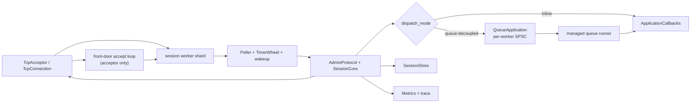
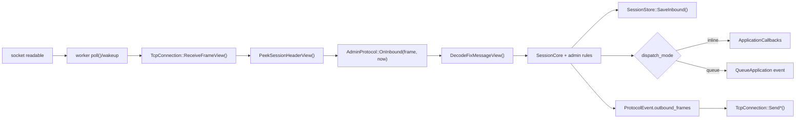
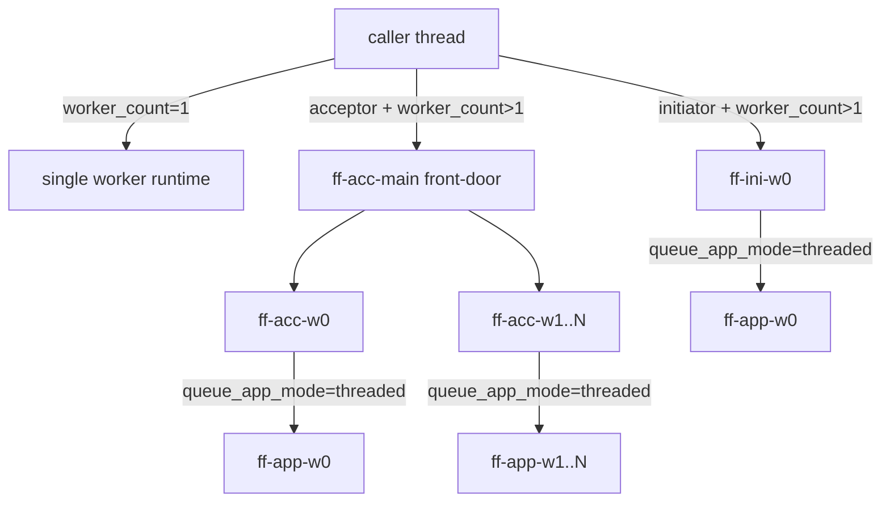

# NimbleFIX Architecture

This document describes the internal architecture of NimbleFIX: how code is organized, how data flows through the system, and how the major components interact.

---

## Module Map

```
nimblefix/
├── base/          Low-level utilities shared by all modules
├── codec/         FIX message parsing and encoding
├── message/       Message data model (builder, view, typed view)
├── profile/       Protocol profile loading, dictionary, artifact format
├── session/       Session state machine, admin protocol, recovery
├── store/         Message persistence (memory, mmap, durable batch)
├── transport/     TCP socket I/O
└── runtime/       Engine orchestration, workers, pollers, metrics, trace
```

### Dependency Graph

```
runtime ──► session ──► codec ──► message ──► profile
   │            │                      │
   │            └──────► store         └──► base
   │
   └──► transport ──► base
   └──► store
   └──► profile
```

Modules depend downward only. `base` has no FIX-specific dependencies. `transport` and `store` are independent of each other and of higher-level FIX semantics.

## Program Structure

The repository is split between the reusable engine surface, executable entrypoints, and operational helpers:

| Path | Role |
|------|------|
| `include/nimblefix/` + `src/` | Public headers and implementation |
| `tools/acceptor/` | Live acceptor binary that wires config into `Engine` + `LiveAcceptor` |
| `tools/initiator/` | Live initiator binary that wires config into `Engine` + `LiveInitiator` |
| `bench/` | Benchmark drivers plus the side-by-side QuickFIX comparison harness |
| `tests/` | Regression, runtime, soak, and integration coverage |
| `scripts/` | Helper entrypoints used by developers and CI for offline build/test/bench flows |
| `samples/` | Example `.ffd` profiles and overlays used by docs, tests, and codegen fixtures |
| `docs/` | Architecture and development documentation |

At runtime, the tools do very little policy themselves. They parse CLI or config-file input, populate runtime config structs, and hand control to `Engine`, `LiveAcceptor`, or `LiveInitiator`. That keeps the hot-path logic inside the library rather than duplicated across binaries.

Public headers live under `include/nimblefix/`, while implementation code lives under `src/`.

---

## Layer-by-Layer

### 1. Base (`include/nimblefix/base/`)

Foundation types used everywhere:

| Type | Purpose |
|------|---------|
| `Status` | Error-or-OK result with message string |
| `Result<T>` | Either a value or a `Status` error |
| `SpscQueue<T>` | Lock-free single-producer-single-consumer queue with fixed capacity |
| `InlineSplitVector<T, N>` | Inline storage for ≤N elements, overflows to heap vector |

> **Note:** `TimerWheel` lives in `include/nimblefix/runtime/timer_wheel.h`, not `base/`. It is listed in the Runtime section below.

`Status` error codes:

```
kOk, kInvalidArgument, kIoError, kBusy, kFormatError,
kVersionMismatch, kNotFound, kAlreadyExists
```

### 2. Profile (`include/nimblefix/profile/`)

Protocol metadata system. NimbleFIX keeps XML out of the hot path, but protocol metadata can arrive either as precompiled `.art` artifacts or as `.ffd` dictionaries parsed once at startup. Both paths normalize into the same runtime dictionary layout before workers start.

**Pipeline:**

```
.ffd (dictionary text)  ──►  dictgen  ──►  .art (binary artifact)  [optional precompilation]
                        or
.ffd (dictionary text)  ──►  Engine parses once at startup
                                         │
                                         ├── StringTable
                                         ├── FieldDefs (tag → type, name, flags)
                                         ├── MessageDefs (MsgType → name, flags, field rules)
                                         ├── GroupDefs (count_tag → delimiter, member fields)
                                         ├── AdminRules
                                         ├── ValidationRules
                                         └── LookupTables
```

**Key types:**

| Type | Role |
|------|------|
| `LoadedProfile` | mmap'd view of a `.art` binary artifact |
| `NormalizedDictionaryView` | Read-only accessor over profile sections — field/message/group lookups |
| `ProfileRegistry` | Holds all loaded profiles for the engine |
| `ProfileLoader` | Loads `.art` files with optional `madvise`/`mlock` page warming; also loads `.ffd` dictionaries directly into memory |

**Artifact sections** (`SectionKind` enum):

```
kStringTable, kFieldDefs, kMessageDefs, kGroupDefs,
kAdminRules, kValidationRules, kLookupTables,
kTemplateDescriptors, kMessageFieldRules, kGroupFieldRules
```

**Dictionary input format** (`.ffd`):

```
profile_id=1001
field|35|MsgType|string|0
message|D|NewOrderSingle|0|35:r,49:r,56:r,453:o
group|453|448|Parties|0|448:r,447:r,452:r
```

**Overlay format**: Multiple `.ffd` files can be merged. The first provides the baseline, additional files extend or override fields/messages/groups.

### 3. Message (`include/nimblefix/message/`)

Two representations of a FIX message:

**`Message`** — Owned, heap-allocated, writable:

```cpp
auto msg = MessageBuilder{"D"}
    .set_string(11, "ORD-001")
    .set_int(38, 100)
    .add_group_entry(453)
        .set_string(448, "PARTY-A")
        .set_char(447, 'D')
        .set_int(452, 3);
auto message = std::move(builder).build();
```

**`MessageView`** — Zero-copy, read-only, references original buffer:

```cpp
auto field = view.get_string(11);       // → optional<string_view>
auto qty = view.get_int(38);            // → optional<int64_t>
auto group = view.group(453);           // → optional<GroupView>
auto entry = group->entry(0);           // → GroupEntryView
auto party_id = entry.get_string(448);  // → optional<string_view>
```

**`TypedMessageView`** — MessageView bound to a dictionary for validation:

```cpp
auto typed = TypedMessageView::Bind(dictionary, view);
typed.validate_required_fields(&missing_tag);  // Check required fields present
```

**`FixedLayoutWriter`** — Hot-path encoder with pre-computed O(1) slot mapping:

```cpp
// Build layout once at startup
auto layout = FixedLayout::Build(dictionary, "D").value();

// Per-message (hot path):
FixedLayoutWriter writer(layout);
writer.set_string(11, "ORD-001");       // O(1) slot write
writer.set_int(38, 100);
writer.add_group_entry(453)
    .set_string(448, "PARTY-A");
writer.encode_to_buffer(dictionary, options, &buffer);
```

`FixedLayout::Build()` pre-computes tag → slot index mappings. `FixedLayoutWriter` writes directly to pre-allocated slots at known offsets — no hash map lookups, no field-list scanning. The hybrid path (`set_extra_string()` etc.) appends extension fields outside the fixed layout for venue-specific custom tags.

**Internal storage**: Fields use a `FieldSlot` linked-list structure within a flat buffer. Groups track entry boundaries via a small frame stack matched against dictionary group definitions.

### 4. Codec (`include/nimblefix/codec/`)

Parsing and encoding FIX byte streams.

**Parsing pipeline:**

```
Raw bytes (span<const byte>)
    │
    ├── PeekSessionHeaderView()     zero-copy fast header scan
    │   └── Extracts: MsgType, SenderCompID, TargetCompID,
    │       MsgSeqNum, BeginString without full decode
    │
    └── DecodeFixMessageView()      full frame decode
        ├── SIMD SOH scanning (simd_scan.h)
        ├── Field tokenization (tag=value\x01 splitting)
        ├── Header validation (8/9/35 ordering, BodyLength, Checksum)
        ├── Group nesting (dictionary-driven stack)
        └── Returns DecodedMessageView { MessageView, ValidationIssues }
```

**Encoding pipeline:**

```
Message + EncodeOptions
    │
    ├── EncodeFixMessage()          allocates output buffer
    │
    └── EncodeFixMessageToBuffer()  reuses EncodeBuffer (reduced alloc)
    │
    └── FixedLayoutWriter::encode_to_buffer()  hot-path O(1) slot writes
        ├── Write header: 8=BeginString|9=<placeholder>|35=MsgType|...
        ├── Write body fields from Message
        ├── Backfill BodyLength
        └── Append 10=<checksum>
```

See `bench/README.md` for the current measured latencies; this document intentionally stays focused on structure and flow so it does not go stale every time the benchmark snapshot changes.

**FrameEncodeTemplate**: For high-frequency messages, pre-builds the fixed portion of the frame. Only variable fields + length + checksum are computed per message.

**SIMD scanning** (`simd_scan.h`):

```cpp
// SSE2 path: 16-byte parallel comparison
auto* p = FindByte(data, len, std::byte{0x01});  // SOH
auto* q = FindByte(data, len, std::byte{'='});    // Field separator

// Automatic fallback to memchr on non-SSE2 platforms
```

**Validation issues** reported during decode:

```
kUnknownField, kFieldNotAllowed, kDuplicateField,
kFieldOutOfOrder, kIncorrectNumInGroupCount
```

### 5. Session (`include/nimblefix/session/`)

FIX session state machine and admin message protocol.

#### SessionCore — State Machine

```
                    ┌────────────────────────────────┐
                    ▼                                │
             kDisconnected                           │
                    │                                │
                    │ OnTransportConnected()          │
                    ▼                                │
              kConnected                             │
                    │                                │
          ┌────────┤                                 │
          │        │ BeginLogon()                     │
          │        ▼                                 │
          │  kPendingLogon ──timeout──► kDisconnected │
          │        │                                 │
          │        │ OnLogonAccepted()               │
          │        ▼                                 │
          │     kActive ◄──────────────────┐         │
          │        │                       │         │
          │   ┌────┤                       │         │
          │   │    │ gap detected          │         │
          │   │    ▼                       │         │
          │   │ kResendProcessing          │         │
          │   │    │                       │         │
          │   │    │ CompleteResend()       │         │
          │   │    └───────────────────────┘         │
          │   │                                      │
          │   │ BeginLogout()                         │
          │   ▼                                      │
          │ kAwaitingLogout ──timeout──► kDisconnected│
          │   │                                      │
          │   │ Logout received                      │
          │   └──────────────────────────────────────┘
          │
          │ OnTransportConnected() (acceptor: skip PendingLogon)
          └─► kActive (direct bind)
```

**Key operations:**

```cpp
session.AllocateOutboundSeq();           // → next_out_seq++ (atomic, no contention)
session.ObserveInboundSeq(seq_num);      // → validate, detect gap
session.BeginResend(begin, end);         // → enter kResendProcessing
session.CompleteResend();                // → return to kActive
session.Snapshot();                      // → {next_in_seq, next_out_seq, state}
```

#### AdminProtocol — FIX Admin Messages

Wraps `SessionCore` and handles the full admin message set:

| MsgType | Name | Direction | Handler |
|---------|------|-----------|---------|
| A | Logon | Both | Handshake initiation/acceptance |
| 5 | Logout | Both | Graceful disconnect |
| 0 | Heartbeat | Both | Keep-alive response |
| 1 | TestRequest | Both | Liveness probe |
| 2 | ResendRequest | Both | Gap recovery request |
| 4 | SequenceReset | Both | Sequence gap fill or hard reset |
| 3 | Reject | Inbound | Session-level rejection |

**`ProtocolEvent`** — returned from `OnInbound()`:

```cpp
struct ProtocolEvent {
    ProtocolFrameCollection outbound_frames;        // Frames to send (inline-first collection)
    ProtocolMessageList application_messages;        // App messages to dispatch
    bool session_active;                             // Session became active?
    bool disconnect;                                 // Should close transport?
    bool poss_resend;                                // PossResend(97) flag set?
    bool session_reject;                             // Session-level reject emitted?
};
```

#### Resend Recovery

When a sequence gap is detected:

```
Inbound seq 45, expected 42 → gap [42, 44]
    │
    ├── AdminProtocol sends ResendRequest(BeginSeqNo=42, EndSeqNo=44)
    │
    ├── Remote sends:
    │   ├── SequenceReset-GapFill (admin msgs in gap)
    │   └── Original app messages with PossDupFlag=Y
    │
    └── SessionCore tracks progress, CompleteResend() when gap filled
```

### 6. Store (`include/nimblefix/store/`)

Persistence layer for message recovery and sequence state.

```
SessionStore (interface)
    ├── MemorySessionStore          RAM only, no persistence
    ├── MmapSessionStore            mmap append-only file
    └── DurableBatchSessionStore    Batch-flush with rollover and archival
```

**Interface:**

```cpp
class SessionStore {
    // Pure virtual (must implement)
    virtual auto SaveOutbound(const MessageRecord& record) -> Status = 0;
    virtual auto SaveInbound(const MessageRecord& record) -> Status = 0;
    virtual auto LoadOutboundRange(uint64_t session_id, uint32_t begin, uint32_t end)
        -> Result<vector<MessageRecord>> = 0;
    virtual auto SaveRecoveryState(const SessionRecoveryState& state) -> Status = 0;
    virtual auto LoadRecoveryState(uint64_t session_id)
        -> Result<SessionRecoveryState> = 0;
    virtual auto ResetSession(uint64_t session_id) -> Status = 0;

    // Optional overrides with default implementations
    virtual auto SaveOutboundView(const MessageRecordView& record) -> Status;
    virtual auto SaveInboundView(const MessageRecordView& record) -> Status;
    virtual auto LoadOutboundRangeViews(...) -> Status;  // view-based range loading
    virtual auto SaveInboundViewAndRecoveryState(...) -> Status;
    virtual auto SaveOutboundViewAndRecoveryState(...) -> Status;
    virtual auto Flush() -> Status;
    virtual auto Rollover() -> Status;
    virtual auto Refresh() -> Status;
};
```

The `*View` methods accept `MessageRecordView` (zero-copy `span<const byte>` payload) and default to copying into `MessageRecord` + calling the owning variant. Store backends can override them for zero-copy persistence.

**DurableBatchStore internals:**

```
store_root/
    ├── active.log           Current segment (append-only)
    ├── active.out.idx       Outbound sequence index
    ├── recovery.log         Session recovery state
    └── archive/
        ├── segment-1.log    Archived segment
        ├── segment-1.out.idx
        ├── segment-2.log
        └── segment-2.out.idx
```

**Rollover modes:**

| Mode | Trigger |
|------|---------|
| `kDisabled` | No automatic rollover |
| `kUtcDay` | Automatic at UTC midnight |
| `kLocalTime` | Automatic at local midnight (configurable UTC offset) |
| `kExternal` | Manual `Rollover()` call |

### 7. Transport (`include/nimblefix/transport/`)

TCP socket I/O with frame boundary detection.

```cpp
class TcpConnection {
    static auto Connect(host, port, timeout) -> Result<TcpConnection>;
    auto Send(bytes, timeout) -> Status;
    auto ReceiveFrameView(timeout) -> Result<span<const byte>>;
    auto Close() -> void;
};

class TcpAcceptor {
    static auto Listen(host, port, backlog) -> Result<TcpAcceptor>;
    auto TryAccept() -> Result<optional<TcpConnection>>;
    auto Accept(timeout) -> Result<TcpConnection>;
};
```

**Frame detection**: The receiver scans for `8=` (BeginString), reads BodyLength, consumes the body, and verifies the checksum before returning a complete frame.

### 8. Runtime (`include/nimblefix/runtime/`)

The runtime layer is where the library becomes a process. It loads profiles, builds worker shards, binds sockets, owns timer wheels and wakeups, routes connections, exposes `SessionHandle`s, and turns configuration knobs into a concrete topology.

#### Engine

Central coordinator:

```cpp
class Engine {
    auto LoadProfiles(config) -> Status;     // Load .art files
    auto Boot(config) -> Status;             // Initialize runtime, workers
    auto ResolveInboundSession(header) -> Result<ResolvedCounterparty>;
    void SetSessionFactory(SessionFactory);  // Dynamic session acceptance
};
```

Primary responsibilities:

- Load `.art` and/or `.ffd` profiles into `ProfileRegistry`
- Materialize shared runtime services: metrics, trace, managed queues, store factories
- Build the worker-shard inventory consumed by `LiveAcceptor` and `LiveInitiator`
- Provide lifecycle (`Boot()`, `Run()`, `Stop()`) and `SessionHandle` surfaces for non-owner threads

#### LiveInitiator / LiveAcceptor

Event-driven endpoint drivers:

```
LiveAcceptor                          LiveInitiator
    │                                     │
    ├── OpenListeners("main")             ├── OpenSession(id, host, port)
    │   └── TcpAcceptor::Listen()         │   └── TcpConnection::Connect()
    │                                     │
    └── Run()                             └── Run()
        ├── poll() on listener FDs            ├── poll() on connection FDs
        ├── AcceptReadyListener()             ├── ProcessConnection()
        │   └── Accept → ConnectionState      │   ├── ReceiveFrameView()
        ├── ProcessConnection()               │   ├── DecodeFixMessageView()
        │   ├── Peek header                   │   ├── AdminProtocol::OnInbound()
        │   ├── BindConnectionFromLogon()     │   └── DispatchAppMessage()
        │   │   └── ResolveInboundSession()   │
        │   ├── AdminProtocol::OnInbound()    ├── ProcessPendingReconnects()
        │   └── DispatchAppMessage()          │   └── Exponential backoff + jitter
        │                                     │
        └── TimerWheel::PopExpired()          └── TimerWheel::PopExpired()
            └── Heartbeat/timeout                 └── Heartbeat/timeout
```

`LiveAcceptor` adds listener management and front-door connection routing. `LiveInitiator` adds outbound connect/reconnect loops. Both otherwise reuse the same worker-owned session, codec, store, transport, metrics, and tracing layers.

#### Runtime Shape Matrix

| Shape | Key knobs | Threads that exist | What changes materially |
|-------|-----------|--------------------|-------------------------|
| Single-worker inline | `worker_count=1`, `dispatch_mode=inline` | caller thread only | no worker `std::jthread`, no app queue hop, lowest complexity |
| Multi-worker inline acceptor | `worker_count>1`, `dispatch_mode=inline` | front-door + `worker_count` session workers | accepts on front-door, hands each session to one owning shard |
| Queue-decoupled co-scheduled | `dispatch_mode=queue-decoupled`, `queue_app_mode=co-scheduled` | same as inline topology | session workers enqueue app events, then explicitly poll/drain them on the same worker threads |
| Queue-decoupled threaded | `dispatch_mode=queue-decoupled`, `queue_app_mode=threaded` | front-door or initiator workers + `worker_count` app workers | app callbacks move off the session workers onto per-worker SPSC queues |
| Initiator runtime | `LiveInitiator` | no front-door thread | each worker owns connect, reconnect, timers, decode, encode, and send for its sessions |

#### End-to-End Runtime Shape



#### Worker Sharding

```
Engine
  ├── Worker[0] (std::jthread)
  │   ├── ShardPoller (poll/epoll wrapper)
  │   ├── TimerWheel
  │   ├── ConnectionState[] (owned sessions)
  │   ├── SpscQueue<PendingConnection> (inbox from front-door)
  │   └── SpscQueue<OutboundCommand> (inbox from app thread)
  │
  ├── Worker[1]
  │   └── ... (same structure, independent sessions)
  │
  └── Front-door thread (acceptor only)
      └── Accepts connections, routes to least-loaded worker
```

Each live session is owned by exactly one shard. That shard owns the socket registration, session state, timers, replay state, store interaction, and application dispatch for the session. The acceptor front-door can touch a connection only long enough to read the logon and decide which shard should adopt it. After handoff, the worker owns the session exclusively.

`listener.worker_hint` influences the preferred landing shard for new acceptor sessions, while the front-door still keeps load and live connection counts in mind when multiple workers are available.

#### Application Dispatch

`dispatch_mode` is the main topology switch after worker ownership is set:

- `kInline`: the application callback runs directly on the session worker thread.
- `kQueueDecoupled`: the worker emits queue items into a per-worker SPSC queue.
- `queue_app_mode=kCoScheduled`: the queue is drained on the same worker thread when the runtime polls managed queues.
- `queue_app_mode=kThreaded`: a dedicated `ff-app-wN` thread drains the queue and runs callbacks off the hot path.

Queue overflow handling is explicit through `queue_full_policy` (`kCloseSession`, `kBackpressure`, `kDropNewest`).

#### Observability

**MetricsRegistry**: Counters and gauges for connections, messages, errors, sequence gaps.

**TraceRecorder**: Ring-buffer of timestamped trace events (session state transitions, protocol events, timer firings). Enabled via `trace_mode = kRing`.

---

## Data Flow: Complete Inbound Path



Step-by-step:

1. A worker wakes because a socket is readable, a timer fired, or another thread signalled its wakeup pipe.
2. `TcpConnection::ReceiveFrameView()` assembles a complete FIX frame from the socket buffer.
3. `PeekSessionHeaderView()` performs a cheap header read to identify `MsgType`, the session key, and sequence context before the full decode.
4. `AdminProtocol::OnInbound()` performs the full decode and feeds the result into `SessionCore`.
5. `SessionCore` handles sequence rules, resend / gap logic, heartbeats, logout transitions, and protocol state updates.
6. The worker persists inbound records and any updated recovery state through the configured `SessionStore`.
7. Application messages are either delivered inline or published into the per-worker queue, depending on `dispatch_mode`.
8. Any admin or replay response frames returned from the protocol layer are sent on the same worker that owns the session.

## Data Flow: Complete Outbound Path

```mermaid
flowchart LR
    APP["application code / SessionHandle"] --> CMD["per-worker command queue"]
    CMD --> WORKER["owning session worker"]
    WORKER --> SEQ["SessionCore::AllocateOutboundSeq()"]
    SEQ --> SEND["AdminProtocol::SendApplication()"]
    SEND --> ENC["FixedLayoutWriter / FrameEncodeTemplate / EncodeFixMessageToBuffer()"]
    ENC --> STORE["SessionStore::SaveOutbound()"]
    STORE --> TX["TcpConnection::Send*()"]
    TX --> WIRE["bytes on wire"]
```



Step-by-step:

1. Application code builds a `Message` or uses a typed writer and calls into `SessionHandle`.
2. If the caller is not already on the owner thread, the send request is pushed into the worker's command queue and the worker is woken up.
3. The owning worker allocates the next outbound sequence number through `SessionCore`.
4. `AdminProtocol::SendApplication()` applies FIX-session fields, chooses the encode path, and materializes the outbound frame.
5. The store persists the outbound message before the bytes leave the process so replay can recover it later.
6. The same worker writes the bytes to the transport and updates metrics / trace state.

---

## Threading Model

NimbleFIX does not hide topology decisions. Thread count, callback placement, polling strategy, and CPU pinning all come from explicit config, and each combination maps to a concrete process shape.

### Knobs That Change The Shape

| Knob | Typical values | What it changes |
|------|----------------|-----------------|
| `worker_count` | `1`, `N>1` | whether the runtime collapses onto the caller thread or spawns one worker per shard |
| `dispatch_mode` | `inline`, `queue-decoupled` | whether app callbacks run on the session worker or hop through a queue |
| `queue_app_mode` | `co-scheduled`, `threaded` | whether queue draining stays on the worker or moves to dedicated app threads |
| `poll_mode` | `blocking`, `busy` | idle CPU burn vs minimum jitter |
| `front_door_cpu` | unset or CPU id | acceptor front-door affinity |
| `worker_cpu_affinity` | CSV list | per-worker pinning |
| `app_cpu_affinity` | CSV list | per-app-worker pinning in threaded queue mode |
| `listener.worker_hint` | worker id | preferred landing shard for new acceptor sessions |

### Thread Topology



#### Acceptor

| Thread | Name | Count | Role | CPU Pin |
|--------|------|-------|------|---------|
| Front-door | `ff-acc-main` | 1 | Accept TCP connections, read Logon, choose a worker, and hand off the socket | `front_door_cpu` |
| Session worker | `ff-acc-w{N}` | `worker_count` | Own sessions exclusively: decode, sequence, timer, encode, send, replay | `worker_cpu_affinity[N]` |
| App worker | `ff-app-w{N}` | `worker_count` (if `queue_app_mode=threaded`) | Drain SPSC queues and invoke business callbacks | `app_cpu_affinity[N]` |

#### Initiator

Same worker/app structure, minus the front-door thread:

| Thread | Name | Count | Role | CPU Pin |
|--------|------|-------|------|---------|
| Session worker | `ff-ini-w{N}` | `worker_count` | Own sessions: connect, reconnect, decode, sequence, timer, encode, send | `worker_cpu_affinity[N]` |
| App worker | `ff-app-w{N}` | `worker_count` (if `queue_app_mode=threaded`) | Drain SPSC queues and invoke business callbacks | `app_cpu_affinity[N]` |

When `worker_count=1`, the runtime stays on the caller's thread and does not spawn worker `std::jthread`s. Raising `worker_count` turns each shard into its own thread; enabling `queue_app_mode=threaded` then creates one app worker per session worker.

### Common Topologies

| Shape | Threads | Typical config | Why you would choose it |
|-------|---------|----------------|-------------------------|
| Single-thread initiator | caller thread only | `worker_count=1`, `dispatch_mode=inline` | simplest debugging and deterministic local testing |
| Single-thread acceptor | caller thread only | `worker_count=1`, `dispatch_mode=inline` | single-session local harnesses and smoke setups |
| Multi-worker acceptor | `ff-acc-main` + `ff-acc-wN` | `worker_count>1`, `dispatch_mode=inline` | isolate session hot paths without paying a queue hop |
| Co-scheduled queue runtime | same as above | `dispatch_mode=queue-decoupled`, `queue_app_mode=co-scheduled` | decouple callback lifetime from decode while keeping thread count flat |
| Threaded queue runtime | workers + `ff-app-wN` | `dispatch_mode=queue-decoupled`, `queue_app_mode=threaded` | protect session workers from blocking business logic |

### Thread Lifecycle

```
Engine::Boot()
    │
    ├── LoadProfiles()           (cold, caller's thread)
    │
LiveAcceptor::OpenListeners()    (cold, caller's thread)
    │
    ├── ResetWorkerShards(N)     Create N ShardPoller + TimerWheel + inbox (no threads yet)
    │
LiveAcceptor::Run()
    │
    ├── if N > 1: StartWorkerThreads()
    │   └── spawn N std::jthread, each runs WorkerLoop(worker_id)
    │       ├── SetCurrentThreadName("ff-acc-wN")
    │       └── ApplyCurrentThreadAffinity(worker_cpu_affinity[N])
    │
    └── Front-door loop on caller's thread
        ├── accept() + read Logon
        ├── SelectAcceptWorkerId() → hinted, then load-aware worker choice
        ├── EnqueuePendingConnection(worker_id, conn)  (lock inbox, push)
        └── SignalWorkerWakeup(worker_id)               (write 1 byte to pipe)
```

All threads are `std::jthread` — calling `Stop()` or destroying the runtime joins them cleanly.

### Session Ownership

**Each session belongs to exactly one worker thread. That worker alone handles protocol state, timers, replay, store persistence, encode, and send for the session. No session-level locks are needed on the hot path.**

When the front-door accepts a connection, it routes the connection to a worker via an inbox (mutex-protected push, then pipe-based wakeup). Once the worker adopts the connection, the front-door never touches it again.

Cross-thread session access goes through `SessionHandle`. Query paths (`Snapshot()`, `Subscribe()`) are safe from any thread. Send paths (`Send*()` / `SendEncoded*()`) enqueue onto a per-worker SPSC queue and wake the target worker via its pipe fd. Each queue is single-producer: the first sending thread claims it, and later producer threads receive `kInvalidArgument` instead of silently violating the queue contract:

```cpp
// Safe query paths from any thread:
session_handle.Snapshot();
session_handle.Subscribe();

// Cross-thread send path:
// one producer thread per SessionHandle send queue.
session_handle.Send(msg);

// Owning-worker / inline-callback only.
// Outside inline callbacks this fast-fails.
session_handle.SendBorrowed(view);
message_view.get_string(11);             // Only within callback scope
```

### Application Callback Modes

#### Inline (`kInline`, default)

```
Session Worker Thread
    decode → validate → sequence → store
                                    │
                         OnAppMessage(event)   ← your code runs HERE
```

- Zero-copy `MessageView` in callback — no materialization overhead
- Callback **must not block** (no disk I/O, no mutex waits, no sleeps)
- Lowest possible latency

#### Queue-Decoupled (`kQueueDecoupled`)

```
Session Worker Thread                     App Worker Thread
    decode → validate → sequence → store
                                    │
                         SPSC push ──────► SPSC pop → OnAppMessage(event)
```

Two sub-modes:

| Sub-mode | Where app callback runs | Thread |
|----------|------------------------|--------|
| `kCoScheduled` | On session worker thread, during explicit `PollManagedQueueWorkerOnce()` call | Same as session worker |
| `kThreaded` | On dedicated app worker thread (`ff-app-wN`) | Separate thread |

`kCoScheduled` is useful when you want queue ownership semantics without increasing thread count. `kThreaded` is the runtime shape to choose when application code may block or when you want clean CPU isolation between protocol work and business logic.

Queue overflow policies when SPSC fills up:

| Policy | Behavior |
|--------|----------|
| `kCloseSession` | Close the session |
| `kBackpressure` | Return `Busy`, session worker retries later |
| `kDropNewest` | Silently drop the event |

### Cross-Thread Communication

| Path | Mechanism | Hot path? |
|------|-----------|-----------|
| Front-door → Worker | Mutex-protected inbox + pipe wakeup | No (once per connection) |
| Worker → App (queue mode) | Per-worker SPSC queue | Yes |
| App → Worker (send) | Per-worker SPSC command queue + pipe wakeup | Yes |
| Worker → Worker | Not directly supported (go through application layer) | — |
| Any → Worker (wakeup) | `PollWakeup::Signal()` writes 1 byte to pipe fd | Yes |

`PollWakeup` uses a per-worker `pipe(2)` fd pair. The `poll()` call monitors both connection fds and the wakeup fd. A single-byte write from any thread makes `poll()` return immediately.

### Polling Modes

| Mode | `poll()` timeout | CPU usage | Latency |
|------|-----------------|-----------|---------|
| `kBlocking` (default) | Configurable (e.g. 50ms) | Low when idle | Higher tail latency on sparse traffic |
| `kBusy` | 0 (return immediately) | 100% per worker core | Minimal latency jitter |

In busy-poll mode, worker threads spin continuously without sleeping. This is the recommended mode for ultra-low-latency deployments where each worker is pinned to a dedicated CPU core.

### CPU Affinity

NimbleFIX uses `pthread_setaffinity_np()` (Linux) and `pthread_setname_np()` for thread naming. Non-Linux platforms silently no-op.

```
engine.front_door_cpu = 0           # Pin front-door to core 0
engine.worker_cpu_affinity = 1,2,3  # Pin workers to cores 1-3
engine.app_cpu_affinity = 4,5,6     # Pin app workers to cores 4-6
engine.poll_mode = busy             # Spin-loop (requires dedicated cores)
```

Typical low-latency deployment:

```
Core 0:  Front-door (accept only)
Core 1:  Session worker 0  ← hot path, isolated
Core 2:  Session worker 1
Core 3:  Session worker 2
Core 4:  App worker 0      (if kThreaded)
Core 5:  App worker 1
Core 6:  App worker 2
```

### Concurrency Rules

1. Each `SessionCore` is owned by exactly one worker thread — never shared.
2. Worker threads never take locks on the hot path.
3. Cross-thread communication uses `SpscQueue` (lock-free, wait-free).
4. `std::atomic` counters cover metrics and connection counts; no mutex is required there.
5. `std::mutex` is reserved for cold-path operations such as profile registry updates, metrics snapshots, and managed queue runner setup.
6. Front-door handoff is the only acceptor cross-thread session transfer.
7. `MessageView` is thread-affine to the callback scope — copy if you need to retain data elsewhere.
8. Hot-path atomics use `std::memory_order_relaxed` for counters and `acquire/release` for SPSC queue head/tail.

---

## Profile Artifact Format

Binary format loaded via mmap:

```
┌──────────────────────────┐
│ Magic (4 bytes)          │  "FFPF"
│ Format Version (4 bytes) │
│ Profile ID (8 bytes)     │
│ Schema Hash (8 bytes)    │
│ Build ID (8 bytes)       │
│ Section Count (4 bytes)  │
├──────────────────────────┤
│ Section Table            │  Array of {kind, offset, size}
├──────────────────────────┤
│ StringTable              │  Packed null-terminated strings
├──────────────────────────┤
│ FieldDefs                │  Tag → {type, name_offset, flags}
├──────────────────────────┤
│ MessageDefs              │  MsgType → {name_offset, flags, rule_offset, rule_count}
├──────────────────────────┤
│ GroupDefs                │  CountTag → {delimiter_tag, name, member_fields}
├──────────────────────────┤
│ MessageFieldRules        │  Per-message: tag → required/optional
├──────────────────────────┤
│ GroupFieldRules          │  Per-group: tag → required/optional
├──────────────────────────┤
│ LookupTables             │  Hash tables for fast field/message/group lookup
└──────────────────────────┘
```

All sections are offsets into to the same mmap'd buffer — zero-copy, zero-allocation access.
